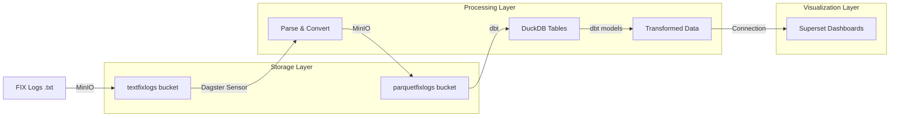
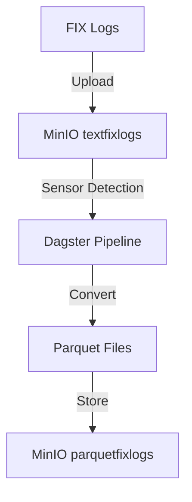
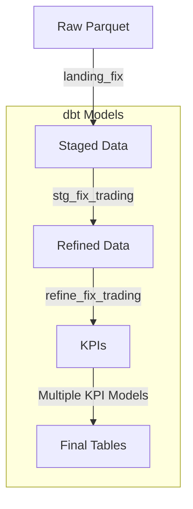
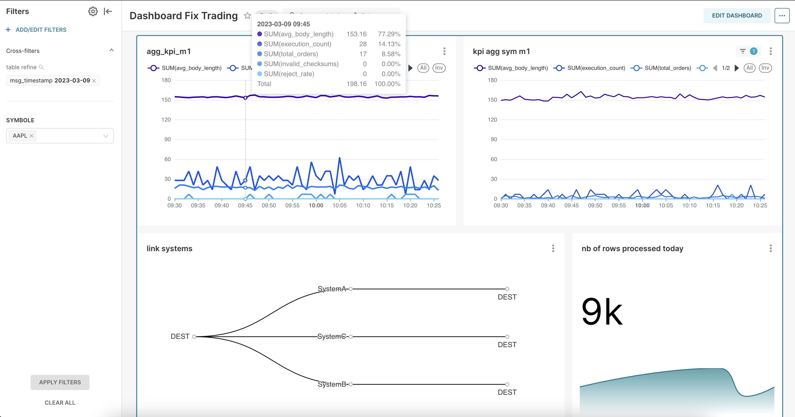

# FIX Trading Pipeline Project
A comprehensive data pipeline for processing and analyzing FIX (Financial Information Exchange) trading data using modern data stack technologies.

## Author(s) : 

Antoine larcher + My LLM friends see down bellow


## Architecture Overview

### Microservices

| Service | Purpose | Port |
|---------|---------|------|
| **MinIO** | S3-compatible object storage for FIX logs | 9000, 9001 |
| **PostgreSQL** | Metadata storage and pipeline tracking | 5432 |
| **DuckDB** | Analytical database for dbt transformations | - |
| **Dagster** | Workflow orchestration and monitoring | 3000 |
| **Superset** | Data visualization and analytics | 8088 |

### Data Flow



## Pipeline Components

### 1. Data Ingestion
- **Source**: FIX log files (.txt)
- **Storage**: MinIO S3-compatible storage
- **Conversion**: Parquet format for efficient querying



### 2. Data Processing
- **dbt Models**: SQL-based transformations

- **dbt docs**: https://dr0ant.github.io/FIX_trading/
- **Layers**:
  - Raw Data (00_landing_fix)
  - Staging (01_staging_fix)
  - Intermediate (02_intermediate_fix)
  - KPIs (03_KPI_fix)



## Getting Started

1. **Start the Infrastructure**:
```bash
docker-compose up --build
```

2. **Access Services**:
- Dagster UI: http://localhost:3000
- MinIO Console: http://localhost:9001
- Superset: http://localhost:8088

3. **Default Credentials**:
```yaml
MinIO:
  user: minioadmin
  password: minioadmin

Superset:
  user: admin
  password: admin

PostgreSQL:
  user: admin
  password: admin
  database: fix_db
```

## Development

### Local Development
```bash
# Run dbt models locally
dbt run --profiles-dir ~/.dbt --target dev

# Start Dagster in development mode
dagster dev -f dagster/deployments/fix_pipeline/definition.py
```

### Project Structure
```
FIX_trading/
├── dagster/
│   ├── deployments/
│   │   └── fix_pipeline/
│   │       ├── pictet_fix_project/    # dbt project
│   │       ├── definition.py          # Dagster pipeline
│   │       └── fix_sensor.py          # FIX file sensor
│   └── docker-compose.yml             # Infrastructure setup
```

## Monitoring & Maintenance

- Monitor pipeline runs in Dagster UI
- Check processed files in PostgreSQL
- View data quality metrics in Superset
- Monitor MinIO storage usage

## Contributing

1. Fork the repository
2. Create a feature branch
3. Submit a pull request


## Fancy screenshots

### Superset Dashboard


### Dagster Sensor


### Dagster Assets


### Dagster Assets


### Minio Storage txt files 


### Minio Storage parquet files


## Collaboration

We are in 2025, of course I use my LLMs friends to fasten the process thanks to :
- https://chatgpt.com/ : Ok but often need to be super guided and often miss context
- https://claude.ai/new : My debugger Man , one of my favorit
- https://chat.deepseek.com/ : Fast but low smart still give different answers so interesting
- https://gemini.google.com/app?hl=fr : please stop propising using google services every 2 prompts ...