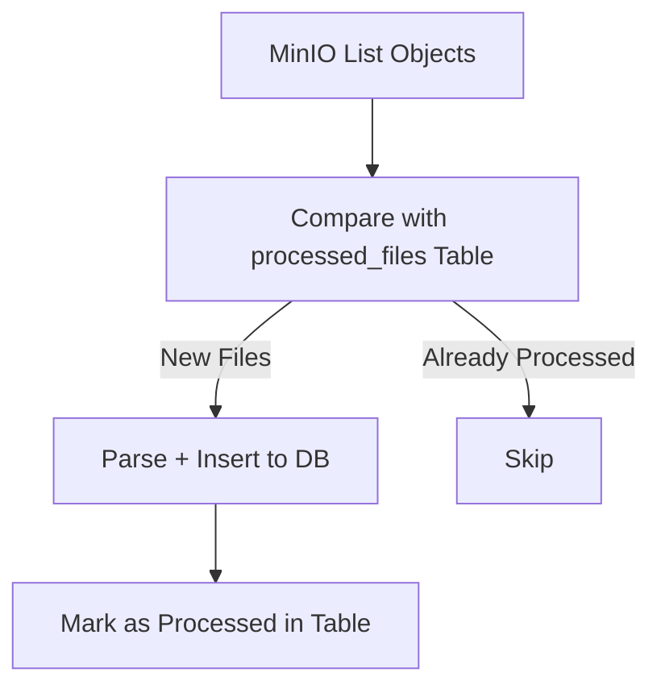
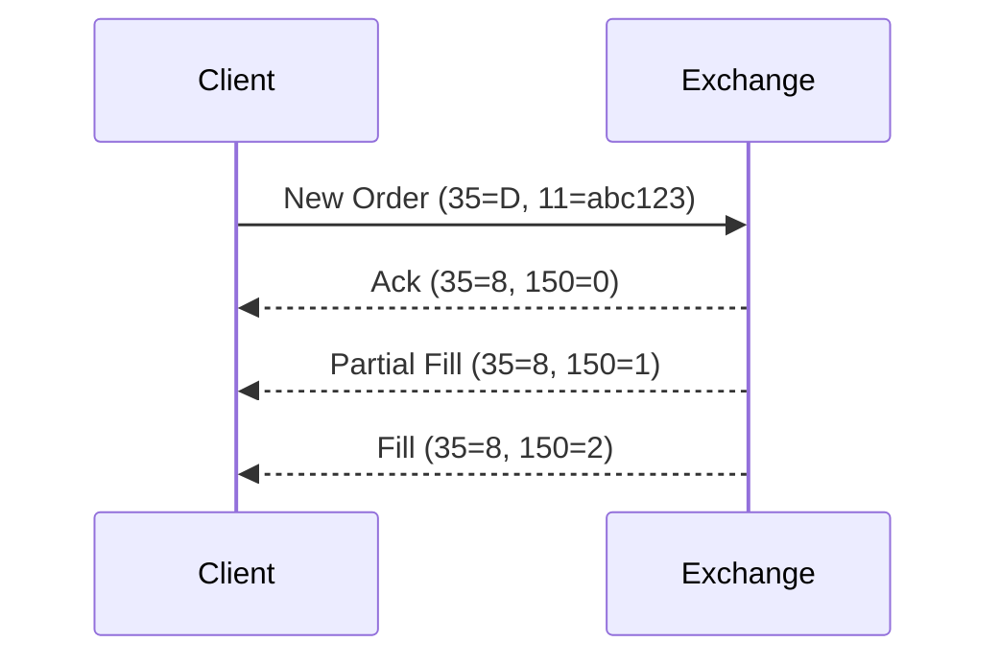

# FIX Message Processing Pipeline - Open Source Architecture

This project demonstrates a scalable open-source data pipeline for ingesting, processing, historizing, and visualizing FIX messages from multiple trading systems.

## 📚 Business Context

The goal is to process and analyze FIX messages emitted by various trading systems. These messages represent the lifecycle of financial trades and can be updated multiple times before being executed. Our challenge is to:

- Collect messages from several systems
- Parse, track, and historize orders (including updates)
- Monitor trade execution via dashboards
- Ensure scalability, modularity, and idempotent processing

---

## 🧱 Infrastructure Overview

The architecture is entirely based on open-source tools:

| Layer               | Tool               | Purpose                                  |
|---------------------|--------------------|------------------------------------------|
| Object Storage      | MinIO              | S3-compatible log storage                |
| Ingestion Engine    | Python + QuickFIX  | Parse FIX logs                           |
| Database            | PostgreSQL         | Raw + normalized storage                 |
| Transformation      | dbt                | Data Vault + staging models              |
| Orchestration       | Dagster            | Triggers pipelines, schedules, sensors   |
| Dashboarding        | Superset           | Visualize KPIs and trade stats           |

---

## 📦 Data Flow

```mermaid
flowchart TD
    A[MinIO - FIX Logs] --> B[Dagster Sensor]
    B --> C[Parser (QuickFIX)]
    C --> D[PostgreSQL - Raw FIX]
    D --> E[dbt - Staging Layer]
    E --> F[dbt - Data Vault]
    F --> G[Superset Dashboards]
```

---

## 🧪 Idempotent Ingestion Design

To avoid duplicate processing:



We use a control table in Postgres:

```sql
CREATE TABLE processed_files (
    filename TEXT PRIMARY KEY,
    last_processed TIMESTAMP,
    rows_ingested INT
);
```

---

## 🔄 Order Lifecycle Modeling

Each trade can be updated multiple times. We track the lifecycle using `ClOrdID (11)` as the **merge key**, updating based on `TransactTime (60)`.



In SQL, we keep the latest version of each order:

```sql
SELECT *
FROM (
  SELECT *,
         ROW_NUMBER() OVER (
           PARTITION BY fix_tags->>'11', system
           ORDER BY fix_tags->>'60' DESC
         ) AS rn
  FROM fix_messages
) sub
WHERE rn = 1;
```

---

## 🛠 Technologies Used

- **Python** for FIX parsing using QuickFIX
- **MinIO** as an S3-compatible store for log files
- **PostgreSQL** for raw and modeled data
- **dbt** for Data Vault 1.0 + staging models
- **Dagster** for orchestration, sensors, and schedules
- **Superset** for building dashboards and monitoring KPIs

---

## 📊 Suggested KPIs

- Number of orders per system per day
- Average time between order and execution
- Cancel-to-trade ratio
- Orders by status (`OrdStatus`)
- Execution latency trends

---

## 🚀 Future Improvements

- Replace file polling with MinIO SNS event-based triggers
- Add Kafka for real-time ingestion of FIX streams
- Add dbt tests and data contracts
- Enrich dashboards with trade attribution metrics

---

## 🧾 Appendix

- FIX tag reference: [FIXimate](https://www.onixs.biz/fix-dictionary.html)
- dbt documentation: https://docs.getdbt.com/
- Dagster sensors: https://docs.dagster.io/concepts/partitions-schedules-sensors/sensors
